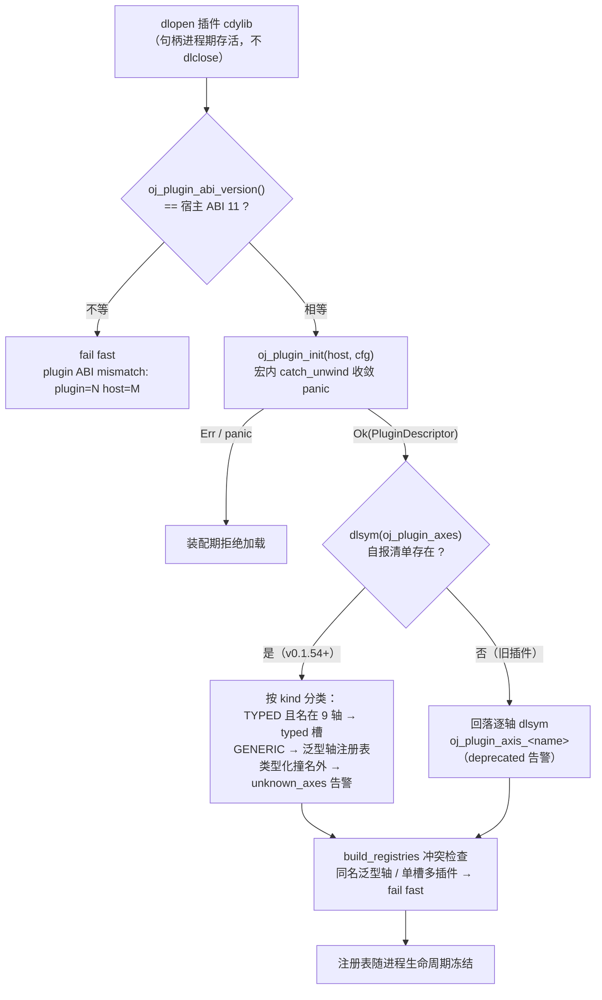
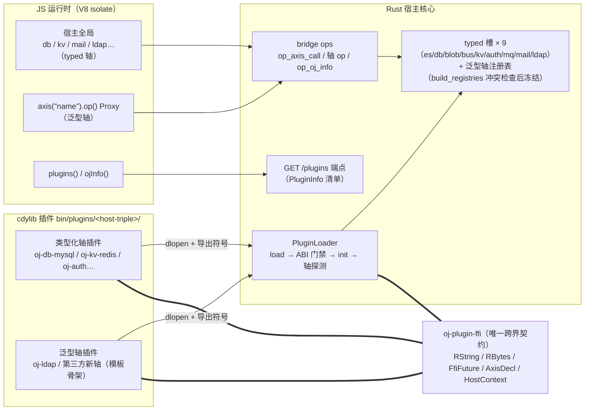

# oj 插件开发手册（第三方）

插件系统把外部分布式后端（db 方言、blob 驱动、bus 消息、kv 存储、es 引擎，以及
v0.1.54 起任意自命名泛型轴）抽成**动态链接库**，宿主按平台目录扫描或按清单装配。

**给谁读**：第三方插件作者。本手册覆盖从环境准备、生命周期、入口宏范式、轴选择、
配置、错误约定、调试到发布与迁移的全流程，并附系统架构总览（§13，含架构图/启动
时序图）与设计决策记录（§14：为什么是 cdylib + C-ABI FFI）。**新轴起手请直接拷贝
[`tools/plugin-template`](../../tools/plugin-template/README.md)**（泛型轴骨架，命名/
宏/配置/构建四契约齐全）。宿主侧装配语义见 `dev-guide.md` §13；配置写法见
`user-manual.md` §3 与 devkit api-manual §10。

## 1. 开发环境准备

- **工具链**：Rust stable（edition 2024；rustc 版本基线见 CI 矩阵
  `.github/workflows/plugin-matrix.yml`）。目标机无需 Rust——发行产物是 cdylib +
  宿主二进制。
- **宿主构建辅助**：在 oj 仓库内开发时用 `cargo xtask`（一律 `--release`，
  debug 构建不在支持范围内）：
  ```bash
  cargo xtask bin                    # 主程序 → bin/oj
  cargo xtask plugin <name>          # 构建插件 + 拷入 bin/plugins/<host-triple>/
  cargo xtask plugin <name> --check  # PluginLoader 预检（§9）
  cargo xtask build                  # oj + 全部第一方插件 + devkit 归置 bin/
  ```
- **起手两条路径**（细节照模板 README）：
  - **路径 A（推荐）**：`cp -r tools/plugin-template plugins/oj-<name>` → 删模板
    Cargo.toml 的空 `[workspace]` 段 → 加进根 workspace members →
    `cargo xtask plugin <name>` 联编。
  - **路径 B（独立仓库）**：`cargo build --release` 自编译，按 loader 文件名
    （`lib<name>.dylib`，`<name>` = descriptor.name 而非 crate 名）手动拷入
    `bin/plugins/<host-triple>/`。
- **依赖纪律**：插件只依赖 `oj-plugin-ffi`（path 依赖，随插件仓库拷贝）+ 各自后端
  SDK；**不依赖宿主 crate**（§12）。

## 2. 插件生命周期（load → ABI 门禁 → init → 轴注册）

单次 `dlopen`，四个阶段（`src/bridge/plugin_loader.rs` 的 `load_one`）：

1. **load**：`dlopen`（`ffi::load_forget`），句柄**进程期泄漏**（设计如此，不
   dlclose；vtable 指针永久有效）。
2. **ABI 门禁**：`oj_plugin_abi_version()` 与宿主 `ABI_VERSION`（当前 **11**）
   **严格相等**才继续；不等 → fail fast（`plugin ABI mismatch: plugin=N host=M`）。
   构建指纹（rustc/契约 crate/triple）仅诊断，不匹配只告警。
3. **init**：`oj_plugin_init(host, cfg)`——宏内 `catch_unwind` 把 panic 收敛为
   `RResult::Err("panic in plugin init")`（§8）。插件在此建 runtime/单例状态、
   校验 cfg（fail-fast 哲学：未知键返回 Err，装配期拒绝加载，不静默忽略拼错的
   配置），并返回 `PluginDescriptor`（内嵌 abi_version 由宿主二次校验）。
   cfg 字符串由三级解析产出（§7）。**init 必须幂等**：重复 init 返回已有
   descriptor（`OnceLock`/`get_or_init` 兜底）。
4. **轴注册（探测）**：v0.1.54 起**自报清单优先**——`dlsym("oj_plugin_axes")`
   取 `RVec<AxisDecl>`（轴名 + kind + vtable），按 kind 分类：TYPED 且名在
   `TYPED_AXES`（es/db/blob/bus/kv/auth/mq/mail/ldap，9 个）→ 填 typed 槽；
   GENERIC → 泛型轴注册表（JS `axis("name")` 面）；名不在 TYPED_AXES 的类型化
   自报 → `unknown_axes` 告警。清单符号缺失的**旧插件回落逐轴 dlsym**
   （`oj_plugin_axis_<name>`，deprecated 告警）。之后装配层 `build_registries`
   做冲突检查（同名泛型轴多插件 / 单槽轴多插件 → fail fast），注册表随进程
   生命周期冻结。

生命周期全景（fail-fast 分支即上列四阶段的拒绝路径）：



## 3. 契约类型面（oj-plugin-ffi）

宿主与插件只通过 `oj-plugin-ffi` crate 的类型跨边界（**唯一允许**）；tokio/tracing
等运行时类型绝不过线。

| 类型 | 说明 |
|------|------|
| `RString` | stabby `String`，`repr(C)`，`&s[..]` 取 `&str` |
| `RBytes` | stabby `Vec<u8>`（字节载荷） |
| `RVec<T>` | stabby `Vec`（轴自报清单载体） |
| `RResult<T,E>` | stabby `Result`；`Ok`/`Err` 是**关联函数**——只能构造、不能模式匹配；消费侧 `std::result::Result::from(r)` 转标准 Result 后 match（`?` 对 stabby Result 无效） |
| `RArc<T>` | stabby `Arc`（`HostContext` 的载体） |
| `FfiFuture` | `{ state, poll, take, free }` 异步句柄（§6） |
| `HostContext` | 宿主回调集：`log(level, msg)`（level: 0=trace 1=debug 2=info 3=warn 4=error）、`deliver(topic, payload)`（bus 订阅回投；插件线程调用须返回快） |
| `PluginDescriptor` | `{ name, semver, abi_version, fingerprint, desc }`（desc 必填，§10） |
| `GenericVtable` | 泛型轴 vtable：`call(op: RString, args: RString) -> FfiFuture`（v0.1.54） |
| `AxisDecl` | 自报清单条目：`{ name, vtable, kind }`，kind = `AXIS_KIND_TYPED`(0) / `AXIS_KIND_GENERIC`(1) |

各类型化轴 vtable 见 `oj-plugin-ffi/src/{es,db,blob,bus,kv,auth}.rs`（ldap/mail/mq
同目录）。方法签名形态：同步函数返回 `FfiFuture`；`connect` 产 handle
（`{"handle":N}` JSON），`close` 释放。**auth 轴特例**（`AuthGuardVtable`，唯一同步
轴，不返回 `FfiFuture`）：`verify(path_no_base, method, authorization, headers_json)
-> RResult<RString, RString>`，ok 值 JSON `null` = 匿名放行、对象 = 注入 `http.user`，
Err = 401 消息。请求级热路径，参考第一方 `plugins/oj-auth`。

## 4. `oj_plugin_entry!` 范式全解

入口宏生成全部导出符号，**禁止手写 `#[no_mangle]` 绕过**（descriptor 内
abi_version 二次校验兜底）。语法（与 `oj-plugin-ffi/src/lib.rs` 宏注释逐字一致）：

```rust
oj_plugin_entry!(init);                                          // 零轴
oj_plugin_entry!(init, kv => &KV_VT);                            // 单轴（类型化 kind）
oj_plugin_entry!(init, kv => &KV_VT, auth => &AUTH_VT);          // 多轴
oj_plugin_entry!(init, config: "cache", kv => &KV_VT);           // 带配置键
oj_plugin_entry!(init, config: "cache", generic(cache) => &CACHE_VT);  // 泛型轴
// 类型化与泛型可混用；条目列表后的尾逗号被容忍（oj_plugin_entry!(init, kv => &VT,)）：
oj_plugin_entry!(init, config: "cache", kv => &KV_VT, generic(cache) => &CACHE_VT,);
```

生成符号清单：

| 符号 | 何时生成 | 说明 |
|---|---|---|
| `oj_plugin_abi_version()` | 恒 | 返回 `ABI_VERSION`（严格相等门禁） |
| `oj_plugin_init(host, cfg)` | 恒 | 内建 `catch_unwind`，panic → `Err("panic in plugin init")` |
| `oj_plugin_axis_<name>()` | 每个轴臂 | 返回静态 vtable 指针（擦除为 `*const c_void`）；**轴标识 `:lower` 进符号名** |
| `oj_plugin_axes()` | 恒 | 轴自报清单 `RVec<AxisDecl>`（v0.1.54 宿主优先路径；kind 区分类型化/泛型） |
| `oj_plugin_config_key()` | **仅当**写了 `config: "<key>"` | 宿主 cfg 三级解析第 2 级依据 |

规则与红线：

- **`config: "<key>"` 必须前置**（单独宏规则避免与轴名 ident 歧义）。
- `axis => &VT` 是类型化 kind 臂（9 个保留轴才用）；`generic(name) => &VT` 是泛型
  kind 臂——泛型轴**必须写 `generic(...)`**：裸名字按类型化 kind 进清单，旧宿主会
  把 `GenericVtable` 当类型化 vtable 解释（UB）。
- **轴名手写小写**：per-axis 符号强制 `:lower`，但自报清单 `stringify!` 原样——
  大写轴名会出现「清单名 ≠ 符号名」的失配。
- **vtable 必须静态可寻址**：`static VT: GenericVtable = ...;`。堆上 vtable =
  悬垂指针。
- **轴 ↔ vtable 类型配对由作者保证**：宏对 vtable 表达式是裸传擦除，写错类型
  **能通过编译**、宿主按轴转型后 UB。类型化臂推荐用 `oj_plugin_ffi::axis::<轴>`
  helper（每个 helper 只接受该轴 vtable 类型，写错编译不过）：
  ```rust
  oj_plugin_ffi::oj_plugin_entry!(init, db => oj_plugin_ffi::axis::db(&VTABLE));
  ```
- 未列出的轴不导出符号 = 不提供该轴；`oj_plugin_entry!(init)` 零轴 = 纯自描述插件。
- **desc 必填**：一句人话写清轴 + 驱动 + 宿主最低版本（会出现在
  `GET {base}/plugins` 与 JS `plugins()`，运维据此辨识）。

## 5. 类型化轴 vs 泛型轴：选择与协议设计

| | 类型化轴（9 槽） | 泛型轴（v0.1.54 起） |
|---|---|---|
| 轴名 | 只能是 es/db/blob/bus/kv/auth/mq/mail/ldap | 任意小写名（**避开 9 个保留名**） |
| 宿主改动 | 加新类型化轴要改宿主（`TYPED_AXES` + `Registrations` + `fill_typed_slot`） | **零宿主改动、零 ABI 变更** |
| JS 调用面 | 宿主装配的全局对象（`db`/`kv`/`mail`…，签名由宿主全局类定义） | `axis("name").op(...args, opts?)` Proxy |
| 入参校验 | 宿主白名单层（如 ldap/mail 的宿主 `validate_call`）+ 插件纵深 | **插件全权负责**（宿主只查表转发） |
| 适用 | 替换/扩展第一方后端实现（db 方言、blob 驱动、kv、auth 守卫…）；要宿主全局面与既有生态一致 | **新轴**（cache/queue/任何自定义后端）；迭代快的私有协议 |

**泛型通道 JSON 协议设计建议**（照 oj-ldap 的 `plugins/oj-ldap/src/lib.rs` 头部
协议表）：

- `args` 恒为**位置参数 JSON 数组**字符串；约定末位可选 opts 对象承载命名参数
  （实例选单 `key`、分页 `pageSize`、凭据覆盖等）；未知 opts 键忽略。
- 结果走 **JSON bytes**；布尔判定型 op（bind/compare）返回 `true|false` 而非
  信封——「业务上的失败」与「错误」分开：错误一律 future Err。
- op 集合固定可查：未知 op 报错**带 known 列表**：
  `ldap: unknown op '<op>'（known: bind|search|search_paged|whoami|compare）`。
- 错误文案规范：稳定、机器可读的 `<轴>.<op>: <字段> must be <约束>` 形态
  （校验错在插件内抛出前给出，与宿主侧历史文案逐字一致可无缝迁移调用方）。

**性能特征**：通道纯开销基准（`benches/bridge.rs` 的 `bench_ldap_channel`，
mock vtable 立即返回、N=1000/迭代，两次运行）——typed ~1674/~3358 ns/call，
generic ~447/~1305 ns/call，**泛型通道快 2.6~3.7x**。架构原因：typed 宿主通道
是「JS 全局方法 → `op_ldap_call` → **宿主入参白名单校验** → 校验后 Value
**再序列化** → `FfiLdapBackend::call` → vtable → 插件**再解析**」的多层结构；
泛型通道是「`axis()` Proxy → `op_axis_call` → 查表取句柄 → **(op, args) 字符串
直通** vtable → 插件解析一次」——省掉宿主校验层与一次完整 JSON 序列化/解析往返。
注意这是**纯通道开销**：真实后端延迟（ms 级起）主导端到端时延时差距缩小；
typed 通道多出的宿主校验层是安全纵深，迁泛型意味着校验责任转移到插件（§11）。

## 6. FfiFuture 异步桥（唯一异步路径）

插件内自建 tokio runtime（`#[tokio::main]` 不经用——插件 init 在宿主线程调用）。
推荐形态（见第一方插件 `oj-kv-redis` / `oj-blob-s3`）：

```rust
struct CallState {
    rx: tokio::sync::oneshot::Receiver<Result<Vec<u8>, String>>,
    result: Option<Result<Vec<u8>, String>>,
}
// poll: try_recv → 1 成功 / -1 错误 / 0 未就绪（宿主 yield_now 轮询）
// take: result.take() → RResult<RBytes, RString>
// free: Box::from_raw 释放（幂等，null 安全）
```

`spawn_ffi_future(&state().rt, async { ... })`：异步工作 `spawn` 到插件 runtime，
oneshot 收结果，返回 `FfiFuture`（poll/take/free 已由 ffi 统一实现，照
`plugins/oj-db-mysql` 的 future 助手用法）。同步完成的 mock/纯计算用
`ready_ok(bytes)` / `ready_err(msg)`。

**返回编码约定**：结构化返回值走 JSON 字节（如 `get` → `"value"`/`null`、
`expire` → `true`，`connect` → `{"handle":N}`）；空操作返回空字节。时长跨线
以秒计（Redis EXPIRE 整秒契约）。

## 7. 插件配置：`plugins:` 一段三用 + cfg 三级解析（v0.1.54）

`config.yaml` 的 `plugins:` 段统一为 **map**（旧 list 写法 `plugins: [a, b]` 已废弃，
解析报错 fail-fast）：

```yaml
plugins:
  kv-redis: {}                        # 键 = 要加载的插件名；空对象 = 透传回落轴适配器
  auth:
    jwt_secret: "change-me"           # 非空对象 = 原样透传为该插件 init cfg（跳过回落）
  my-plugin:
    endpoint: "http://127.0.0.1:9200" # schema 归插件所有（init 校验，非法 Err fail-fast）
```

- **键 = 严格清单**：非空 map 只装配列出的插件（沿用清单门禁：缺文件/身份/`@semver`
  pin 不符 fail fast）；**缺省/空 map = 扫描模式**（加载 `plugins_dir` 全部）。
- **值 = cfg 透传**：非空对象原样透传给插件 `init(cfg)`；**空对象 `{}` = 跳过透传，回落
  轴适配器**（第一方插件由宿主把对应 config 段映射成 cfg，如 es→`cfg.es`、auth→
  `cfg.auth`；无适配器的轴回落 `"{}"`）。

**cfg 三级解析**：插件 `init` 收到的 cfg 字符串按序取第一个命中——

1. `plugins:<name>` 非空对象 → 原样透传（如上）；
2. 插件自报 **config key**（入口宏 `config: "key"`）→ 顶层 `<key>` 段的**全量 Value**。
   段是「读」不是「占」——撞宿主已知段名合法；段未配置给 `"{}"`（段可选是既有语义，
   init 须容忍空 cfg 或自行 fail-fast）；
3. 按名遗留臂（es/auth/mail/ldap 等第一方适配器；无适配器 → `"{}"`）。

未被子报 key 或 `plugins:<name>` 非空透传消费的**未知顶层段**，启动打
`[oj-serve] unconsumed config sections: […] (typo? or plugin not loaded)` 诊断
（拼写错误 / 插件没装的早期信号）；`oj info` CLI 与 JS `ojInfo()` 的 `unconsumed`
段可复查。

## 8. 错误与 panic 约定

**双层收敛（红线）**：

- **init panic**：宏内 `catch_unwind` → `RResult::Err("panic in plugin init")` →
  装配期拒绝加载。init 里做 cfg 校验/资源建立，别留半截全局状态。
- **vtable 方法 panic**：宿主对 vtable 方法**没有** catch_unwind——跨界 unwind
  跨 cdylib 边界是 **UB**。每个 vtable 方法必须用 `catch_future` / `catch_value` /
  `catch_void` 收敛：
  ```rust
  extern "C" fn call(op: RString, args: RString) -> FfiFuture {
      oj_plugin_ffi::catch_future(|| dispatch(op, args)) // panic → 立即错误 future
  }
  ```
  panic 由入口宏（init 层）与 `catch_future`（方法层）双层兜底成 Err。

**错误传递约定**：

- 业务错误经 future 的 **Err** 透传（`ready_err(...)` / oneshhot 送 `Err`），JS 侧
  收到 reject（异常）；**不要**用 ok 值编码错误（布尔型业务判定除外，见 §5）。
- 错误文案规范：稳定前缀 `<轴>.<op>:` + 机器可读约束描述 + 已知集合列表
  （`（known: …）`）；校验错在插件内抛出前给出。文案即契约——改文案是
  **用户可见变更**（调用方按文案分支/排查）。
- 错误消息**不得含机密**（cfg 里的凭据、连接串）；插件日志同理（§9）。

**panic=unwind（禁止 abort）**：插件 **必须**保持 `panic=unwind` profile（不得覆盖
为 abort）。运行期异步任务内 panic 会中止该任务（不拖垮宿主；宿主 panic hook 归因，
见 §9）。根 `Cargo.toml` 的 `[profile.release] panic = "unwind"` 已对第一方插件
生效；第三方 crate 不要自行覆盖 profile。

## 9. 调试与诊断

```bash
# 预检：经宿主 PluginLoader（与真实装配同一入口）加载校验，打印 desc + provided axes
cargo xtask plugin <name> --check
```

- **预检覆盖**：ABI 严格相等 / 身份（descriptor.name == 文件名 stem）/ `@semver`
  pin / 轴符号探测（自报清单 + per-axis 回退）。输出 desc 与 provided axes 清单——
  泛型轴不在 9 轴预检渲染表内，看 `oj info` 的 `generic_axes` 行确认注册。
- **插件日志**：经 `HostContext.log(level, msg)` 上送宿主 tracing（level:
  0=trace 1=debug 2=info 3=warn 4=error）——不要在插件内自建 println!/文件日志，
  统一上送才能拿到宿主的分级/归因。
- **panic 归因**：宿主 panic hook（装配首个插件前安装）输出
  `[oj-plugin] panic while loading plugin '<name>' (host fingerprint: …)` 后透传
  原始 panic。
- **符号级调试**：在 `bin/plugins/<triple>/` 旁保留对应构建的符号文件
  （`symbols/` 目录），`lldb`/`gdb` 附加后 `bt` 定位。

运行宿主（dev）验证：`./bin/oj serve -c config.yaml --api-path src`，JS 侧
`plugins()` / `ojInfo()` / `axis("name").op()` 逐层确认。

## 10. 发布与 ABI 约定

- `ABI_VERSION`（u32，**严格相等**）是唯一硬门禁；构建指纹仅诊断，不匹配告警
  不拒绝。ABI 规则表：

| 变更 | 是否 bump ABI |
|------|--------------|
| 新增一条类型化轴（新 `oj_plugin_axis_<name>` 符号 + 新 vtable 类型） | **否**（探测式，缺符号 = 不提供） |
| 新增泛型轴 / 新增 `oj_plugin_axes` 清单 / 新增 `oj_plugin_config_key` | **否**（v0.1.54 起，探测式） |
| 既有轴 vtable 的 `repr(C)` 形状变更（加方法、改签名） | **是** |
| `PluginDescriptor` / `HostContext` / `AxisDecl` 字段变更 | **是** |
| cfg JSON 新增可选键（schema 归插件所有） | **否**（向后兼容演进走 cfg 字段） |

- **升级顺序**：先升插件到新 ABI 并验证，再升宿主（或同版本原子升级）。
  `cargo xtask build` 全量联编产出宿主 + 全部第一方插件；`bin/plugins/` 随宿主
  二进制一并替换。**不 bump ABI ≠ 可以混跑版本**：跨边界线形状（如
  `{"$oj$i64":…}` / `{"$oj$u64":…}`）是源码级共享约定，旧插件不认识新标记会静默
  串化成文本（错值）。
- **per-axis 符号回退与兼容矩阵**：

| 插件 \ 宿主 | ≥ v0.1.54（kind 判别 + 泛型通道） | < v0.1.54（pre-kind，逐轴 dlsym） |
|---|---|---|
| 新插件（`oj_plugin_axes` 双发） | 全能力：自报清单按 kind 路由，泛型轴 `axis()` 可调 | 加载成功（per-axis 符号回退，泛型轴**不可达**——dlsym 表无此名）；`config:` 自报被忽略，cfg 走按名臂；**泛型臂撞保留名 = 误 cast（UB），禁止部署** |
| 旧插件（无清单符号） | 加载成功，回落逐轴 dlsym（deprecated 告警） | 原行为 |

- 插件自描述 `descriptor.desc` 必填；语义化版本进 `semver`，`@semver` pin 在
  严格清单模式下核对。
- **插件须自包含**：插件依赖自己 + 各自后端 SDK（sqlx、rdkafka、object_store、
  redis、reqwest…），可脱离宿主 workspace 单独编译、独立仓库发版。系统级依赖
  （如 rdkafka 的 librdkafka、openssl）要么静态/vendored 链接，要么在插件 README
  **显式声明**运行环境要求（部署侧 glibc 基线见 CI 矩阵）。共享逻辑不抽公共运行时
  ——复制可接受（决策记录：接受复制）。Windows 上 `oj-bus-kafka` 的 cmake 构建
  特例见原踩坑记录（`cargo xtask` 不重建运行中的自身；`/MT` 混链 LNK4098 良性）。

## 11. 迁移指南：类型化轴插件迁泛型轴（oj-ldap 实例）

动机：新轴零宿主改动；通道开销更低（§5）；配置自报。参考实例
`plugins/oj-ldap`（v0.1.54 由 `LdapVtable` 迁 `GenericVtable`）与
`docs/ldap-integration.md` 的双轨记录。

步骤清单：

1. **vtable 换形**：`LdapVtable { call(req_json) }` →
   `GenericVtable { call(op, args) }`；`static` 保形：
   `static VT: GenericVtable = GenericVtable { call };`
2. **dispatch 收编**：op 分派从「宿主校验后的 req JSON」改为「插件自解析
   (op, args)」——args 是位置参数数组，约定末位 opts 对象。op 集与语义**不变**。
3. **入参校验搬家**：宿主 `validate_call` 白名单逐 op 收进插件（纵深防御不丢），
   **错误文案逐字保持**——调用方按文案排查，文案即契约。
4. **`config: "<key>"` 声明**：沿用既有 config 段名（oj-ldap 用 `config: "ldap"`），
   三级解析第 2 级自动生效；init 对 cfg 做键白名单 fail-fast。
5. **宏臂改写**：`ldap => &LDAP_VT` → `generic(ldap) => &LDAP_VT`；若轴名撞
   保留名（oj-ldap 即 `ldap`），**部署宿主必须 ≥ v0.1.54**（旧宿主误 cast，UB）。
6. **desc 注明宿主最低版本**（如
   `"generic axis, requires host >= v0.1.54"`）。
7. **联编验证**：`cargo xtask plugin <name>` + `--check`；宿主侧 `oj info` 的
   `generic_axes` 应列出轴名；JS `axis("<name>").<op>` e2e 过一遍。
8. **双轨语义确认**：迁移后宿主不再装配对应 typed 槽——宿主遗留全局（如
   `ldap.*`）调用报 `not configured`。这是预期行为：调用面整体切到 `axis()`，
   或让部署方继续用旧版 typed 插件（二者择一，勿混）。

验收对照（oj-ldap）：op 集 `bind/search/search_paged/whoami/compare` 不变；
实例选单从 `new LDAP("ad")` 改为 opts `key`；错误文案与旧版逐字一致；配置段
`ldap:` 不变；`plugins()` 清单 desc 带最低版本声明。

## 12. 第一方插件清单（参照模板）

| 插件 | 轴 | 驱动 | 迁移来源 |
|------|-----|------|---------|
| `oj-es` | es | reqwest | core `bridge/es.rs` |
| `oj-db-mysql` / `oj-db-postgres` | db | sqlx Any 单方言 | core `accessor_sqlx.rs` |
| `oj-blob-s3` | blob | object_store aws | core `bridge/blob.rs` S3Blob |
| `oj-bus-kafka` / `oj-bus-rabbitmq` | bus（+ mq 双轴） | rdkafka / lapin | core `bridge/broker/` |
| `oj-kv-redis` | kv | redis | core `bridge/kv.rs` RedisKV |
| `oj-auth` | auth | jsonwebtoken | core `bridge/auth.rs`（守卫；auth 端点已 JS 化） |
| `oj-mail` | mail | lettre | core `bridge/mail.rs`（v0.1.19 起插件化） |
| `oj-ldap` | ldap（**泛型轴**，v0.1.54 迁移） | ldap3 | 目录查询 + bind 鉴证；参考 §11 |

> 所有第一方插件源码统一位于 `plugins/`；构建产物（cdylib）归置
> `bin/plugins/<triple>/`，由 `.gitignore` 忽略。范式骨架见
> [`tools/plugin-template`](../../tools/plugin-template/README.md)。

## 13. 系统架构与注册机制（总览）

宿主与插件只经 `oj-plugin-ffi` 契约跨界（§3）；加载期宿主主动 `dlopen` + 符号探测
（§2），运行期调用面分两路：类型化轴走宿主装配的全局对象（`db`/`kv`/`mail`/…），
泛型轴走 `axis("name").op()` Proxy 直通（§5）。插件自描述（`PluginInfo`）在装配期
收集，经公共端点 **`GET {base}/plugins`**（ok 信封）与 JS `plugins()` / `ojInfo()`
同源可查，供运维/监控辨识当前进程装配了什么（含 `unknown_axes` 告警清单）。



宿主启动装配时序（`oj serve` 视角；`oj info` 走同一装配面的零连接变体）：

```mermaid
sequenceDiagram
    participant CLI as oj serve
    participant ASM as 装配层（assemble_plugins）
    participant LD as PluginLoader
    participant SO as 插件 cdylib
    participant RG as 注册表（typed 槽 + 泛型轴）
    participant RT as RuntimePool（V8）

    CLI->>ASM: 读 config.yaml（plugins: 段一段三用）
    ASM->>ASM: 清单模式（非空 map）或扫描模式（缺省/空）
    loop 每个待装配插件
        ASM->>LD: load_one(path, cfg)
        LD->>SO: dlopen + oj_plugin_abi_version()
        SO-->>LD: ABI 11（严格相等，否则 fail fast）
        LD->>SO: oj_plugin_init(host, cfg)
        SO-->>LD: PluginDescriptor（catch_unwind 兜底）
        LD->>SO: oj_plugin_axes()（缺失则逐轴 dlsym 回落）
        SO-->>LD: RVec&lt;AxisDecl&gt;（名 + kind + vtable）
        LD-->>ASM: 轴注册结果（typed 槽 / 泛型轴 / unknown_axes 告警）
    end
    ASM->>RG: build_registries（冲突 fail-fast，注册表冻结）
    ASM->>RT: StableState（后端 Arc / oj_info）注入 + 启动 V8 池
    RT-->>CLI: 服务就绪（GET /plugins 可查装配清单）
```

要点（细则见对应章节）：

- **探测优先级**：自报清单 `oj_plugin_axes` 优先（kind 判别路由）；清单缺失的旧
  插件回落逐轴 `dlsym`（deprecated 告警，免重编兼容）——§2。
- **fail-fast 面**：ABI 严格相等、init Err/panic、同名泛型轴多插件、单槽轴多插件、
  严格清单缺文件/身份/`@semver` pin 不符——装配期一律拒绝启动，不静默降级——§2/§7。
- **配置**：`plugins:` 一段三用 + cfg 三级解析，未被消费的未知顶层段启动打
  `unconsumed config sections` 诊断——§7。
- **版本兼容**：「不 bump ABI」≠「可混跑版本」——跨边界线形状（`{"$oj$i64":…}` 等）
  是源码级共享约定，宿主与插件必须同批重建发布；泛型轴撞 9 保留名须宿主
  ≥ v0.1.54——§10 兼容矩阵。

## 14. 设计决策记录：为什么是 cdylib + C-ABI FFI

现行插件系统经历过一次路线更换（2026-09）：最初完成的是**进程内 `Plugin` trait**
方案（编译期链接，trait + `BridgeBuilder` + db 方言 `DbBackend` 注册表，feature-gate
拆分驱动），其依赖倒置成果（`Arc<dyn Trait>` 后端注入 `Extras`/`StableState`）保留
至今；但该路线随后被 **cdylib + C-ABI FFI**（stabby 契约）整体取代。决策要点：

- **进程内方案的硬上限**：依赖仍编译进核心二进制——feature-gate 只能削减驱动
  种类，做不到「不装 kafka 就没有 rdkafka」的按需装卸；`Plugin` 也无法跨仓库
  独立发版（与宿主同工具链、同 workspace 才能编）。
- **FFI 路线的三个已知风险及其化解**（原方案风险节逐一对应）：
  - `Arc` 跨 `.so` 边界 allocator 不匹配 → drop UB → **stabby 类型全权跨界**
    （`RString`/`RArc`/`RVec` 稳定布局，§3），宿主与插件只共享 `oj-plugin-ffi`；
  - `deno_core::Extension` 非 `repr(C)` 过不了边界 → **插件不碰 Extension**，只导出
    `extern "C"` 符号（入口宏生成，§4）；
  - Rust future（`!Unpin`/编译器私有）不可跨 C-ABI → **`FfiFuture` 手写状态机**
    （state/poll/take/free，§6），异步工作留在插件自建 runtime，宿主只轮询。
- **换来的能力**：后端依赖随插件装卸（扫描/清单装配）、插件崩溃隔离
  （`catch_unwind` 双层收敛成 Err 而非 abort 宿主，§8）、第三方可独立仓库发版
  （模板骨架，§1 路径 B）。
- **付出的约束**：ABI 严格相等门禁 + 线形状同批发布（§10）；vtable 方法 panic 必须
  插件内收敛（§8）；tokio/tracing 等运行时类型绝不过线（§3）；无热插拔——op
  命名空间在 `JsRuntime::new` 时一次固定，插件只能在启动装配期装载（这是 V8
  isolate 的本质约束，两条路线下相同）。

> 原方案全文（进程内 trait 路线的完整设计与分阶段计划，未执行）留存于 git 历史
> （`docs/plugins/plugin-architecture.md`，已删除）。

